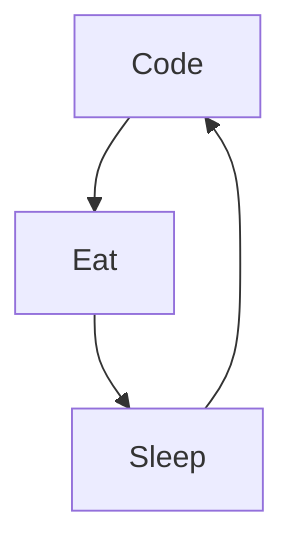

### Hello World ! 👋
Je suis Itto, j'habite à Paris et je suis en formation pour devenir développeuse web full stack, j'adore apprendre des langages et des frameworks comme PHP et Symfony.

<!--
**yteau/Yteau** is a ✨ _special_ ✨ repository because its `README.md` (this file) appears on your GitHub profile.
-->

So this is it :

- 🔭 I’m currently working on  PHP and Symfony
- 🌱 I’m currently learning  lots of amazing things!
- 👯 I’m looking to collaborate on  : never mind!
- 🤔 I’m looking for help with  : ALL! I begin!;)
- 💬 Ask me about ...
- 📫 How to reach me:  Linkedin or email.
- ⚡ Fun fact: 
-->

### Languages and Tools:

[]
[]
[]
[]
[]
[]
[]
[]
[]
[]

[]

 
 
### My daily routine :

### 🔥 Recent GitHub Activity

